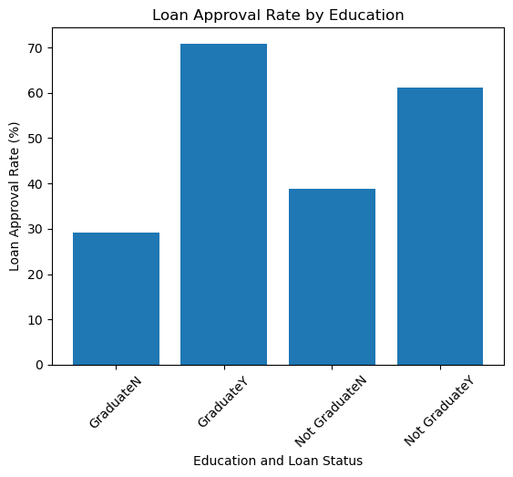

# Mini-project IV

### [Assignment](assignment.md)

## Project/Goals
The goal of this project is to create machine learning model to predict if an individual will be approved of a loan. 

## Hypothesis
- Individuals who are males are more likely to get loan approved 
- Graduated individuals are more likely to get loan approved 

### Hypothesis Testing  
- According to the findings below, despite the number of males and females, graduated and non-graduated,  the approval rates are actually very similar

For detail EDA process, please go [here](notebooks/instructions.ipynb)

- Frequency of different categorical variables : 

#### Gender

#### Married

#### Dependents

#### Applicants' incomes and coapplicants' incomes are both right skewed 

## Data Cleaning
#### Discovering Null Values 

#### Filling null values with mode and mean

## Results/Demo
#### Used RandomForestClassifier to create the predicting model and the result accuracy score was : 77.83%

#### Improved the results by using parameter grid search 

#### Creating Pipeline 

#### Testing the pipeline, first test score gave %72 and second accuracy score with gridsearchCV gave an improved result of 82%

## Challanges 
There were several challenges including tuning the hyperparameters and building a working pipline.  Another challenge is to deploy my model locally and on AWS. 

## Future Goals
In the future if I had more time, I would use more methods for testing as I only used randomforestclassifier for this project. 